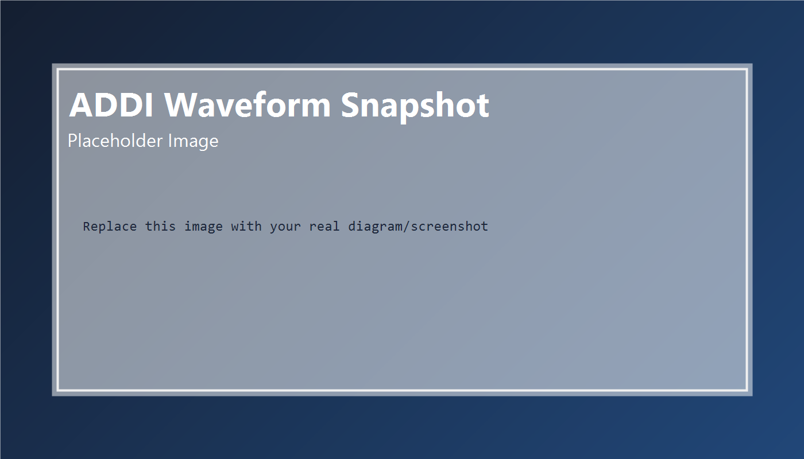

# RISC-V SoC Contest


一个面向竞赛与学习的 RISC-V 处理器小型工程，使用 SystemVerilog 实现了简洁的流水线 CPU 主路径，当前可完成 ADDI 指令链路验证。

## 目录导航

- [核心特性](#核心特性)
- [当前实现范围](#当前实现范围)
- [项目结构](#项目结构)
- [快速开始](#快速开始)
- [架构图占位](#架构图占位)
- [时序说明](#时序说明)
- [实验结果](#实验结果)
- [设计说明](#设计说明)
- [Roadmap](#roadmap)
- [贡献规范](#贡献规范)
- [版本记录](#版本记录)
- [致谢](#致谢)
- [License](#license)

## 核心特性

- 结构清晰：按取指、译码、执行进行模块拆分，便于阅读与迭代。
- 流水线组织：已包含 IF/ID、ID/EX 级间寄存器。
- 最小可运行链路：从 PC 取指到寄存器写回闭环可跑通。
- 面向验证：提供 testbench 与测试数据，可直接进入仿真流程。

## 当前实现范围

- 指令集：RV32I 子集（当前已验证 `ADDI`）。
- 顶层模块：`rtl/riscv_top.sv`
- 关键模块：`pc_counter.sv`、`rom.sv`、`decode.sv`、`execute.sv`、`register.sv`
- 测试平台：`tb/riscv_top_tb.sv`、`tb/pc_counter_tb.sv`

## 项目结构

```text
riscvsoc-contest/
 rtl/          # CPU RTL 源码
 tb/           # Testbench
 test_data/    # 指令与测试数据
 utils/        # 辅助脚本
 sim/          # 仿真输出目录
 doc/          # 设计文档
 Makefile      # 构建/仿真入口
```

## 快速开始

### 1) 获取源码

```bash
git clone https://github.com/yourname/riscvsoc-contest.git
cd riscvsoc-contest
```

### 2) 准备环境

- 仿真器：ModelSim/Questa（当前 Makefile 使用 `vlib`、`vlog`、`vsim`）
- Python 3（可选，用于工具脚本）
- GNU Make

### 3) 运行仿真

```bash
make
```

可用命令：

```bash
make compile   # 仅编译
make sim       # 编译 + 启动仿真
make clean     # 清理仿真产物
make help      # 查看帮助
```

## 架构图占位

当前仓库可先放置架构图到 `doc/arch_overview.png`，README 中先保留占位，后续补图即可。


如暂时不上传图片，也可先使用如下逻辑结构示意：

```text
PC -> ROM -> IF/ID -> Decode -> RegFile -> ID/EX -> Execute -> WriteBack(RegFile)
```

## 时序说明

当前实现以单时钟上升沿驱动流水寄存器，主链路时序可以概括为：

1. IF 阶段：`pc_counter` 输出 `pc_pointer`，`rom` 依据地址取指。
2. IF/ID 锁存：`if2id` 在时钟边沿锁存指令与地址。
3. ID 阶段：`decode` 解析 `opcode/func/rs/rd`，读取寄存器并生成操作数。
4. ID/EX 锁存：`id2ex` 在时钟边沿锁存执行所需信号。
5. EX 阶段：`execute` 进行运算并输出 `wr_reg_en/wr_reg_addr/wr_reg_data`。
6. 写回：`register` 在时钟边沿完成写回。

在当前指令集范围内（`ADDI`），可将近似延迟理解为：取指到写回经历约 2 级流水寄存后完成结果提交。

## 实验结果

建议在本节持续更新你的实测数据（可直接复制以下模板）：

### 基础功能回归

| 用例 | 输入文件 | 预期 | 结果 | 备注 |
|---|---|---|---|---|
| ADDI-01 | `test_data/rv32-p-addi.txt` | x 寄存器写回正确 |  Pass | 已通过 |

### 仿真环境

- 仿真器：ModelSim/Questa
- 运行命令：`make sim`
- 观测方式：波形窗口 + 寄存器值检查

### 波形截图占位



## 设计说明

- `pc_counter.sv` 负责程序计数推进。
- `rom.sv` 依据指令文件输出取指结果。
- `decode.sv` 完成指令字段解析并生成执行操作数。
- `execute.sv` 进行 ALU 计算并产生寄存器写回控制。
- `register.sv` 提供寄存器读写接口。

## Roadmap

- [x] 搭建基础 IF-ID-EX 流水框架
- [x] 打通 `ADDI` 指令执行与写回
- [ ] 增加更多 RV32I 算术/逻辑指令
- [ ] 引入访存与写回阶段扩展
- [ ] 增加冒险处理（stall/forward）
- [ ] 完善自动化测试与覆盖率统计

## 贡献规范

提交前建议遵循以下约定：

1. 分支命名：`feature/*`、`fix/*`、`doc/*`。
2. 提交信息：使用简洁前缀，例如 `feat:`、`fix:`、`docs:`、`test:`。
3. RTL 修改需附带：
   - 对应 testbench 或测试数据更新。
   - 关键波形截图或文字说明。
4. PR 描述至少包含：变更目的、影响模块、验证方式、风险点。

欢迎通过 Issue 或 Pull Request 提交：

- bug 修复
- 新指令支持
- testbench 与验证用例增强
- 文档与注释完善

## 版本记录

### v0.2.0 (计划中)

- 增强 README 文档结构（导航、时序、实验记录模板）
- 补充贡献规范与致谢模块

### v0.1.0

- 完成 IF/ID/EX 主链路
- 支持并验证 `ADDI` 指令基本执行流程

## 致谢

- RISC-V 开源生态与社区文档
- 课程/比赛中提供评测与讨论支持的同学和老师
- 使用与维护 SystemVerilog 仿真工具链的开发者社区

## License

暂未添加 License 文件，建议后续补充 `MIT` 或 `Apache-2.0`。
