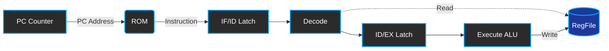

<div align="center">

# 🚀 RISC-V SoC Contest
**面向竞赛与学习的精简指令集 SystemVerilog 软核处理器**

[](https://github.com/)
[](https://github.com/)
[](https://github.com/)
[](https://github.com/)

[概览](#-项目概览) • [核心特性](#-核心特性) • [系统架构](#-系统架构) • [快速开始](#-快速开始) • [测试评估](#-测试评估) • [Roadmap](#-roadmap)

</div>

---

## 📖 项目概览

**RISC-V SoC Contest** 是一个轻量级、面向竞赛与学习的 RISC-V 处理器工程。项目采用 **SystemVerilog** 编写，实现了一个条理清晰的流水线微架构基线。设计的核心旨在于提供一个**结构清晰、易于魔改和拓展**的 CPU 核心。

目前项目已经跑通了最小可验证链路（从 PC 取指到底层寄存器写回的闭环），并成功验证了 RV32I 基础指令集的早期核心指令（如 `ADDI`）。

## ✨ 核心特性

- 🧩 **极简模块化设计**：取指 (IF)、译码 (ID)、执行 (EX) 严格拆分，模块边界清晰，代码极度适合阅读与二次开发。
- 🌊 **标准流水线架构**：内置 `IF/ID`、`ID/EX` 等级间寄存器，建立经典流水线骨架，为后续扩展（如冲突处理与旁路）打下基础。
- 🧪 **开箱即用的验证环境**：集成了 Testbench、十六进制/TXT 转换脚本（Python），以及自动化 Makefile，支持直接进入仿真流程。
- 📦 **轻量级基线**：抛弃繁难冗余的商业化细节，专注于指令集体系结构的本质原理。

## 📊 实现范围

* **指令集架构**：RV32I 子集（当前主要验证 `ADDI` 及基础算术逻辑）。
* **核心模块**：
  * `pc_counter.sv`：程序计数器与取指控制。
  * `rom.sv`：ROM 存储指令读取。
  * `decode.sv`：指令查表解析与操作数生成。
  * `execute.sv`：执行单元 (ALU 核心)。
  * `register.sv`：通用寄存器堆 (RegFile)。

## 🏗️ 系统架构

本项目采用单时钟上升沿驱动的流水寄存器，目前主链路流转依赖如下时序结构：



> **工作流速览**:
> 1. **IF**: `pc_counter` 输出地址，`rom` 依据地址取指。
> 2. **IF/ID**: `if2id` 模块锁存当前指令与 PC 地址。
> 3. **ID**: `decode` 根据 `opcode/func/rs/rd` 对指令解析，并生成操作数。
> 4. **ID/EX**: `id2ex` 保护执行阶段所需的关键控制信号。
> 5. **EX**: `execute` 单元进行算术/逻辑运算。
> 6. **WB**: 数据回写至 `register` 指定地址。

## 📂 项目结构

```text
📦 riscvsoc-contest
 ┣ 📂 rtl/          # 🧠 CPU RTL 源代码 (核心模块与流水线寄存器)
 ┣ 📂 sim/          # 🖥️ 仿真工作目录 (Modelsim/Questa 生成)
 ┣ 📂 tb/           # 🧪 Testbench 与仿真顶层
 ┣ 📂 test_data/    # 📝 指令集测试汇编数据与预期输出
 ┣ 📂 utils/        # 🛠️ 辅助脚本 (包括 RISC-V dump 解析工具等)
 ┣ 📂 veri/         # ⚙️ 验证与编译脚本配置序列
 ┣ 📂 doc/          # 📚 架构设计规范与波形说明文档
 ┗ 📜 Makefile      # 🚀 构建与仿真自动化入口
```

## 🚀 快速开始

### 1. 软件依赖

* **仿真工具**：ModelSim / QuestaSim (工程基于 `vlib`, `vlog`, `vsim` 流程构建)。
* **环境工具**：GNU Make、Python 3.x（辅助脚本需要）。

### 2. 克隆项目

```bash
git clone https://github.com/your-username/riscvsoc-contest.git
cd riscvsoc-contest
```

### 3. 一键编译与仿真

使用 `make` 一键执行流程：

```bash
make sim       # 1. 编译 SystemVerilog 2. 启动 ModelSim 仿真
```

**其他常用命令**:

```bash
make compile   # 仅编译代码，不启动仿真
make clean     # 清理 /sim 目录下的缓存与中间产物
make help      # 查看 Makefile 帮助菜单
```

## 📈 测试评估

所有的验证用例可通过波形窗口与寄存器写回比对进行观测。

| 测试编号 | 测试内容 / 指令 | 测试文件路径 | 期望行为 | 验证状态 |
| :---: | :--- | :--- | :--- | :---: |
| **01** | `ADDI` 指令覆盖 | `test_data/rv32ui-p-addi.txt` | 正确计算并将立即数与基址寄存器相加，写回 `rd`。 | 🟢 **Pass** |
| **02** | 基础跳转测试 | - | 即将引入 | ⏳ WIP |

> *详细仿真波形图可持续更新至 `doc/waveform_addi.png` 并在此处引用。*

## 🗺️ Roadmap

- [x] 搭建基础 IF-ID-EX 流水结构框图
- [x] 重构顶层互连，闭环从取指到写回的通路
- [x] 完成并验证 `ADDI` 指令
- [ ] 增加更多基础逻辑与算术指令 (`ADD`, `SUB`, `AND`, `OR`...)
- [ ] 引入存储器接口，实现 `Lw` / `Sw` 验证
- [ ] 构建流水线数据冒险与控制冒险处理模块 (Forwarding & Stall)
- [ ] 自动化回归测试集成 (CI/CD)

## 🤝 贡献规范

我们欢迎任何形式的优化，无论是添加新指令支持还是完善工具链：

1. **分支约定**：采用 `<type>/<description>` 格式 (例如 `feature/add-jal`, `fix/decode-bug`)。
2. **Commit 信息**：遵守 [Conventional Commits](https://www.conventionalcommits.org/)，使用 `feat:`, `fix:`, `docs:`, `test:` 等前缀。
3. **提交 PR 要求**：
   - 包含新增特性对应的 Testbench 或底层波形验证说明。
   - 尽量保障原有测试集的兼容性 (`make sim` 不报错)。

## 📝 致谢与开源协议

* 感谢 RISC-V 社区提供的指令集规范与生态。
* 感谢日常讨论硬件体系架构的各位同学和老师。
* 本项目暂未指定开源许可协议。推荐未来采用 `MIT` 协议发布。