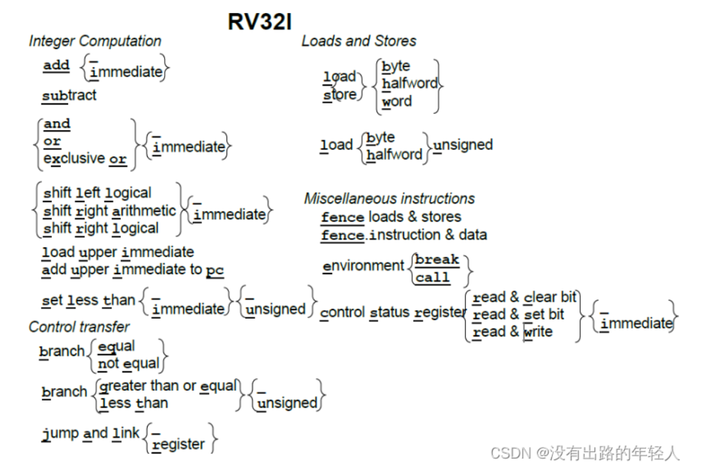
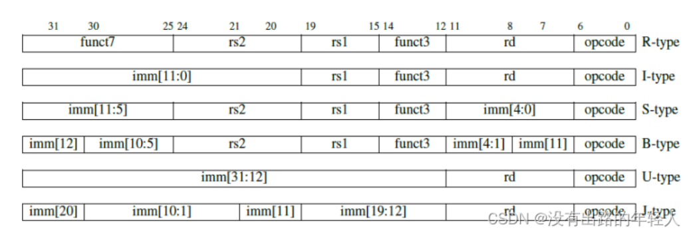
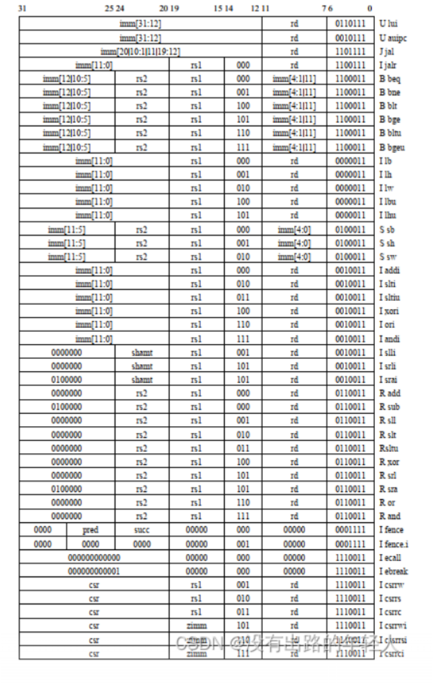
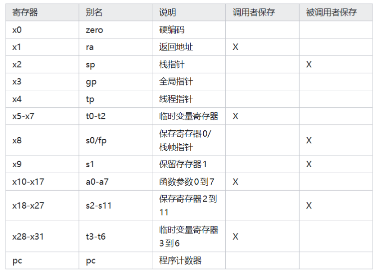
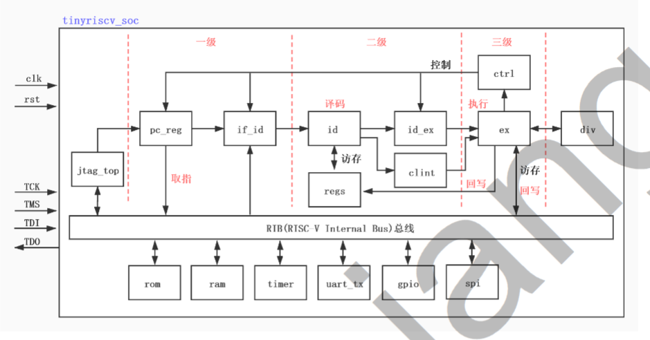

# RV32I指令包括

## 按 opcode 分
| 指令类型 | 功能 | opcode |
|---|----|----|
| R and M | 算术逻辑运算指令 | 0110011 |
| I | 立即数 | 0010011 |
| S | 存储器访问指令 | 0100011 |
| L | 加载指令 | 0000011 |
| J(branch)(short) | 短分支指令 | 1100011 |
| J(jump)(long) | 长跳转指令 | 1.无条件跳转 PC + offset 1101111            2.无条件跳转 rs + offset 1100111 |
| U | 加载常数| 1.加载立即数->rd 0110111   2.PC加上立即数->rd 0010111|
| SCR | 控制和状态寄存器操作 | 1.环境操作 1110011   2.内存屏障指令 0001111 |

## 按照指令类型分

## 寄存器组

## tinyriscv 学习
总体架构
