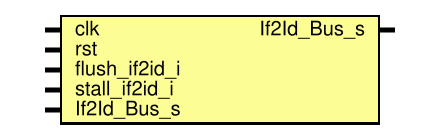
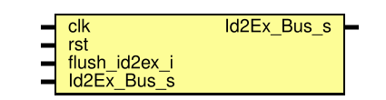
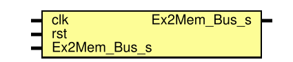
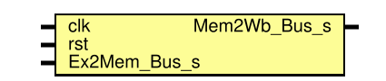
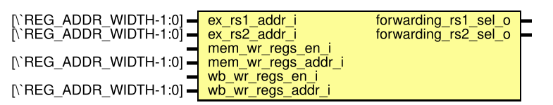

RISCV学习网址
RV32I指令集https://ai-embedded.com/risc-v/riscv-isa-manual/

五级流水线已经搭建完成了

# 一、目录结构
./asm/  存放自己写的汇编代码
./code/ 存放核心代码
./sim/ 存放仿真tb文件
./test/ 存放测试用例
./doc/ 存放文档

# 二、code目录结构
./core 存放核心，比如取指、译码、数据前递等
./define 存放宏定义以及结构体、枚举类型定义
./memory 存放ram以及rom
./pipeline 存放五级流水线
./shangban 存放上板验证代码（主要是一些外设）

# 三、简单介绍接口
## --define.sv
### **宏定义文件，包括基础位宽与地址**
`ADD_WIDTH`     地址位宽
`DATA_WIDTH`    数据位宽
`PC_INIT_ADDR`  程序计数器初始地址
`BYTE_WIDTH`    字节位宽
### **寄存器堆定义**
`REG_NUM`       寄存器数量
`REG_ADDR_WIDTH`     寄存器地址位宽
`ZERO_REG`      零寄存器索引
### **控制信号定义**
`WR_ENABLE `    写使能信号
`WR_DISABLE`    写禁止信号
`RD_ENABLE `    读使能信号
`RD_DISABLE`    读禁止信号

## --rv32i_pkg.sv
### **指令集相关枚举类型**
`Opcode_e`     指令集中的opcode枚举类型
`Inst_R_Type_Funct7_e`  R指令的funct7枚举类型
`Inst_R_Type_Funct3_e`  R指令的funct3枚举类型
### **接口模式枚举类型**
`Ram_Wr_Mask_e`  ram写掩码枚举类型
`Ram_Rd_Mode_e`  ram读模式枚举类型
`Forwarding_Mode_e`  前向传播模式枚举类型
### **指令集相关枚举类型**
`Inst_R_Type_s`  R指令结构体
`Inst_I_Type_s`  I指令结构体
`Inst_S_Type_s`  S指令结构体
`Inst_B_Type_s`  B指令结构体
`Inst_U_Type_s`  U指令结构体
`Inst_J_Type_s`  J指令结构体
### **流水线控制结构体**
`Ex_Ctrl_s`  译码阶段控制信号结构体
`Mem_Ctrl_s`  内存阶段控制信号结构体
`Wb_Ctrl_s`   写回阶段控制信号结构体
`If2Id_Bus_s` 第一级流水线到第二级流水线的总线结构体
`Id2Ex_Bus_s` 第二级流水线到第三级流水线的总线结构体
`Ex2Mem_Bus_s`第三级流水线到内存阶段的总线结构体
`Mem2Wb_Bus_s` 内存阶段到写回阶段的总线结构体

## --riscv_top.sv
顶层模块，用于例化各个模块，并连接各个模块的信号

## --pc.sv

### Diagram

### Ports

| Port name   | Direction | Type             | Description |
| ----------- | --------- | ---------------- | ----------- |
| clk         | input     |                  |             |
| rst         | input     |                  |             |
| jump_en_i   | input     |                  |             |
| jump_addr_i | input     | [`ADD_WIDTH-1:0] |             |
| pc_o        | output    | [`ADD_WIDTH-1:0] |             |
| inst_addr_o | output    | [`ADD_WIDTH-1:0] |             |
| stall_pc_i  | input     |                  |             |

## --rom.sv
### Diagram

### Ports

| Port name   | Direction | Type              | Description |
| ----------- | --------- | ----------------- | ----------- |
| clk         | input     |                   |             |
| rst         | input     |                   |             |
| inst_addr_i | input     | [`ADD_WIDTH-1:0]  |             |
| inst_data_o | output    | [`DATA_WIDTH-1:0] |             |

## Signals

| Name                    | Type                      | Description |
| ----------------------- | ------------------------- | ----------- |
| rom_mem [0:`ROM_SIZE-1] | logic   [`DATA_WIDTH-1:0] |             |

## --if2id.sv
### Diagram

### Ports

| Port name     | Direction | Type | Description |
| ------------- | --------- | ---- | ----------- |
| clk           | input     |      |             |
| rst           | input     |      |             |
| flush_if2id_i | input     |      |             |
| stall_if2id_i | input     |      |             |
| If2Id_Bus_s   | input     |      |             |
| If2Id_Bus_s   | output    |      |             |

## --decode.sv
### Diagram

### Ports

| Port name   | Direction | Type                  | Description |
| ----------- | --------- | --------------------- | ----------- |
| inst_addr_i | input     | [`ADD_WIDTH-1:0]      |             |
| inst_i      | input     | [`DATA_WIDTH-1:0]     |             |
| rs1_data_i  | input     | [`DATA_WIDTH-1:0]     |             |
| rs2_data_i  | input     | [`DATA_WIDTH-1:0]     |             |
| rs1_addr_o  | output    | [`REG_ADDR_WIDTH-1:0] |             |
| rs2_addr_o  | output    | [`REG_ADDR_WIDTH-1:0] |             |
| id2ex_bus_o | output    | Id2Ex_Bus_s           |             |

## Signals

| Name            | Type                        | Description |
| --------------- | --------------------------- | ----------- |
| static_rd_addr  | logic [`REG_ADDR_WIDTH-1:0] |             |
| ALU_OP2_SEL_IMM | id2ex_bus_o                 |             |
| REG_WR_ENABLE   | id2ex_bus_o                 |             |

## --regs.sv
### Diagram

### Ports

| Port name  | Direction | Type                  | Description |
| ---------- | --------- | --------------------- | ----------- |
| clk        | input     |                       |             |
| rst        | input     |                       |             |
| rs1_addr_i | input     | [`REG_ADDR_WIDTH-1:0] |             |
| rs2_addr_i | input     | [`REG_ADDR_WIDTH-1:0] |             |
| rs1_data_o | output    | [`DATA_WIDTH-1:0]     |             |
| rs2_data_o | output    | [`DATA_WIDTH-1:0]     |             |
| wr_rd_en_i | input     |                       |             |
| rd_addr_i  | input     | [`REG_ADDR_WIDTH-1:0] |             |
| rd_data_i  | input     | [`DATA_WIDTH-1:0]     |             |

## Signals

| Name                       | Type                      | Description |
| -------------------------- | ------------------------- | ----------- |
| regs        [0:`REG_NUM-1] | logic   [`DATA_WIDTH-1:0] |             |

## --id2ex.sv
### Diagram

### Ports

| Port name     | Direction | Type | Description |
| ------------- | --------- | ---- | ----------- |
| clk           | input     |      |             |
| rst           | input     |      |             |
| flush_id2ex_i | input     |      |             |
| Id2Ex_Bus_s   | input     |      |             |
| Id2Ex_Bus_s   | output    |      |             |

## --execute.sv
### Diagram

### Ports

| Port name          | Direction | Type              | Description |
| ------------------ | --------- | ----------------- | ----------- |
| Id2Ex_Bus_s        | input     |                   |             |
| Ex2Mem_Bus_s       | output    |                   |             |
| jump_en_o          | output    |                   |             |
| jump_addr_o        | output    | [`DATA_WIDTH-1:0] |             |
| rs1_forward_mode_i | input     |                   |             |
| rs2_forward_mode_i | input     |                   |             |
| mem_forward_data_i | input     | [`DATA_WIDTH-1:0] |             |
| wb_forward_data_i  | input     | [`DATA_WIDTH-1:0] |             |

## Signals

| Name          | Type                      | Description |
| ------------- | ------------------------- | ----------- |
| alu_op1       | logic   [`DATA_WIDTH-1:0] |             |
| alu_op2       | logic   [`DATA_WIDTH-1:0] |             |
| true_rs1_data | logic   [`DATA_WIDTH-1:0] |             |
| true_rs2_data | logic   [`DATA_WIDTH-1:0] |             |

## --ex2mem.sv
### Diagram

### Ports

| Port name    | Direction | Type | Description |
| ------------ | --------- | ---- | ----------- |
| clk          | input     |      |             |
| rst          | input     |      |             |
| Ex2Mem_Bus_s | input     |      |             |
| Ex2Mem_Bus_s | output    |      |             |

## --ram.sv
### Diagram

### Ports

| Port name    | Direction | Type                 | Description |
| ------------ | --------- | -------------------- | ----------- |
| clk          | input     |                      |             |
| addr_i       | input     | [`ADD_WIDTH-1:0]     |             |
| wr_en_mask_i | input     | [`BYTE_PER_WORD-1:0] |             |
| wr_data_i    | input     | [`DATA_WIDTH-1:0]    |             |
| rd_en_i      | input     |                      |             |
| rd_data_o    | output    | [`DATA_WIDTH-1:0]    |             |

## Signals

| Name                        | Type                      | Description |
| --------------------------- | ------------------------- | ----------- |
| ram_data    [0:`RAM_SIZE-1] | logic   [`DATA_WIDTH-1:0] |             |
| word_idx                    | logic   [`ADD_WIDTH-3:0]  |             |
| we                          | logic                     |             |
## --mem2wb.sv
### Diagram

#### Ports

| Port name    | Direction | Type | Description |
| ------------ | --------- | ---- | ----------- |
| clk          | input     |      |             |
| rst          | input     |      |             |
| Ex2Mem_Bus_s | input     |      |             |
| Mem2Wb_Bus_s | output    |      |             |

#### Diagram

#### Ports

| Port name      | Direction | Type                  | Description |
| -------------- | --------- | --------------------- | ----------- |
| Mem2Wb_Bus_s   | input     |                       |             |
| ram_rd_data_i  | input     | [`DATA_WIDTH-1:0]     |             |
| regs_wr_en_o   | output    |                       |             |
| regs_wr_data_o | output    | [`DATA_WIDTH-1:0]     |             |
| regs_rd_addr_o | output    | [`REG_ADDR_WIDTH-1:0] |             |

### Signals

| Name         | Type                      | Description |
| ------------ | ------------------------- | ----------- |
| ram_data_ext | logic   [`DATA_WIDTH-1:0] |             |
## --forwarding.sv

#### Diagram

#### Ports

| Port name            | Direction | Type                  | Description |
| -------------------- | --------- | --------------------- | ----------- |
| ex_rs1_addr_i        | input     | [`REG_ADDR_WIDTH-1:0] |             |
| ex_rs2_addr_i        | input     | [`REG_ADDR_WIDTH-1:0] |             |
| mem_wr_regs_en_i     | input     |                       |             |
| mem_wr_regs_addr_i   | input     | [`REG_ADDR_WIDTH-1:0] |             |
| wb_wr_regs_en_i      | input     |                       |             |
| wb_wr_regs_addr_i    | input     | [`REG_ADDR_WIDTH-1:0] |             |
| forwarding_rs1_sel_o | output    |                       |             |
| forwarding_rs2_sel_o | output    |                       |             |
## --hazard_ctrl.sv

####Diagram

#### Ports

| Port name     | Direction | Type                  | Description |
| ------------- | --------- | --------------------- | ----------- |
| clk           | input     |                       |             |
| rst           | input     |                       |             |
| id_rs1_addr_i | input     | [`REG_ADDR_WIDTH-1:0] |             |
| id_rs2_addr_i | input     | [`REG_ADDR_WIDTH-1:0] |             |
| ex_rd_addr_i  | input     | [`REG_ADDR_WIDTH-1:0] |             |
| ex_is_load_i  | input     |                       |             |
| ex_jump_en_i  | input     |                       |             |
| stall_pc_o    | output    |                       |             |
| stall_if2id_o | output    |                       |             |
| flush_if2id_o | output    |                       |             |
| flush_id2ex_o | output    |                       |             |